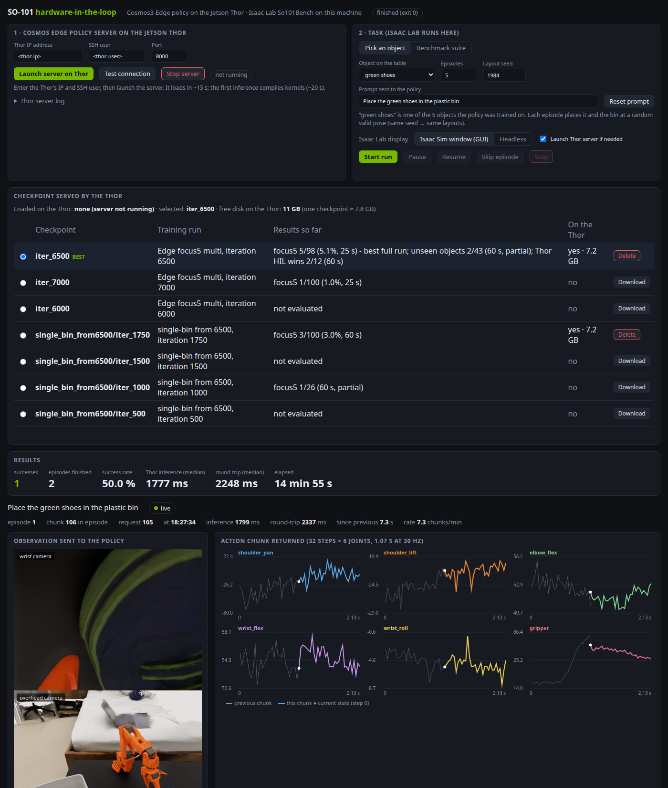
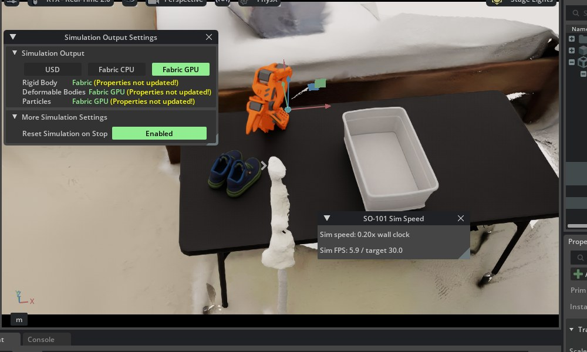
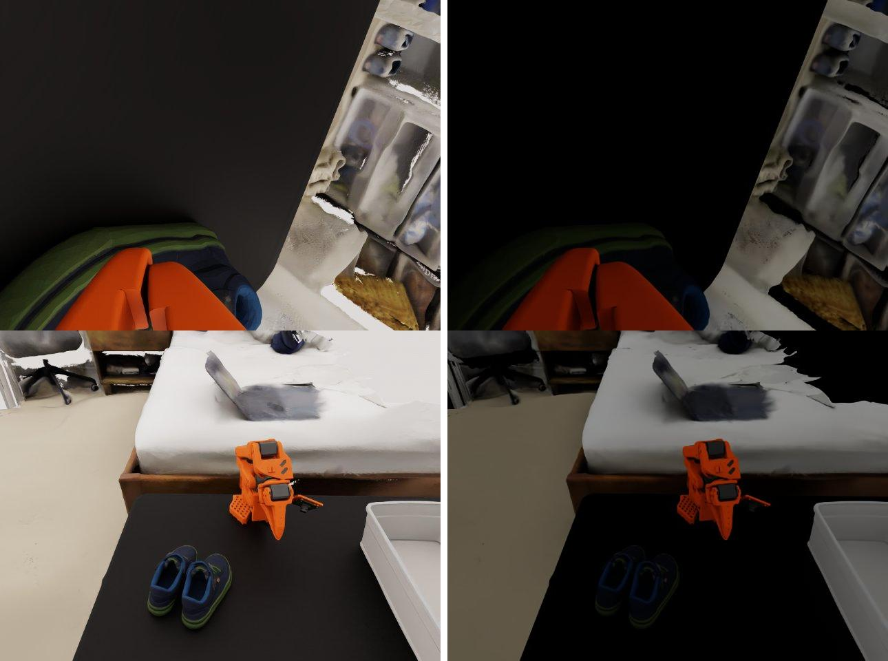
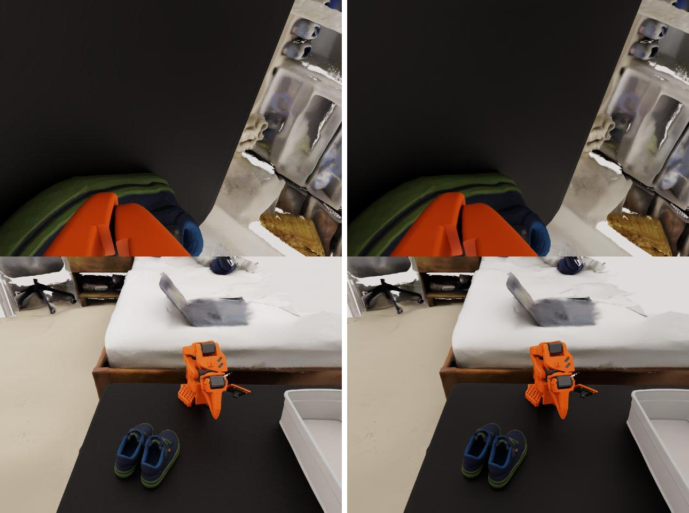

# Cosmos3-Edge SO-101 on a Jetson Thor — hardware-in-the-loop with Isaac Lab

The SO-101 Cosmos3-Edge action policy served **natively on an NVIDIA Jetson Thor**, closing the loop
with the `so101_bench` Isaac Lab digital twin on an **RTX PRO 5000 Blackwell** laptop. A web page on the
laptop launches the policy server on the Thor over SSH, picks the checkpoint, the object and the prompt,
starts Isaac Lab (with or without its window) and shows every camera frame sent to the Thor and every
action chunk it returns.

The same Thor-side setup is what runs on a real SO-101: the policy stays on the Thor; only the client
(Isaac Lab here) is replaced by the robot's cameras and motors.



## Contents

- [Architecture](#architecture)
- [Verified hardware and software](#verified-hardware-and-software)
- [Setup](#setup)
- [Using the web UI](#using-the-web-ui)
- [Checkpoints and results](#checkpoints-and-results)
- [Thor performance](#thor-performance)
- [The Isaac Lab 3.0 port of so101_bench](#the-isaac-lab-30-port-of-so101_bench)
- [What is in this folder](#what-is-in-this-folder)
- [Troubleshooting](#troubleshooting)
- [Limitations](#limitations)

## Architecture

```
 PC / laptop  (RTX PRO 5000 Blackwell Laptop GPU)                    Jetson Thor  (JetPack 7, sm_110)
┌──────────────────────────────────────────────────────────┐       ┌──────────────────────────────────────┐
│ Browser ── http://127.0.0.1:8765                           │       │                                      │
│    ▼                                                       │  SSH  │ serve_thor.sh --tmux / --stop         │
│ webui/so101_thor_ui.py  (one Python process)               │──────►│ checkpoint download / delete / switch │
│  ├─ HTTP API: status, start/stop, Thor control, checkpoints│  key  │ server log                            │
│  ├─ Runner: starts the Isaac Lab client                    │       │                                      │
│  └─ Relay ws://127.0.0.1:8001 ───────────── WebSocket ─────┼──────►│ :8000 OpenPI WebSocket policy server  │
│        ▲  copies every request/response to the page        │  LAN  │ cosmos-framework, Cosmos3-Edge SO-101 │
│        │                                                   │       │ BF16, torch.compile, cuDNN attention  │
│ Isaac Lab 3.0 / Isaac Sim 6.0 — so101_bench                │       └──────────────────────────────────────┘
│  So101Bench-Bin-v0: SO-101 arm, table, bin, objects        │
│  wrist + overhead cameras, PhysX, 30 Hz control            │
└──────────────────────────────────────────────────────────┘
```

**One control cycle**

1. Isaac Lab renders the wrist camera and the fixed overhead camera and stacks them (wrist on top) into
   one 640×960 frame; it reads the arm state (5 joints + gripper, LeRobot `.pos` units).
2. The client sends `{frame, joint_position, gripper_position, prompt}` (msgpack over WebSocket) to the
   local relay, which forwards it unchanged to the Thor and keeps a copy for the page.
3. The Thor returns an **action chunk**: 32 absolute joint targets × 6 joints (1.07 s of motion at 30 Hz).
4. The client executes the 32 steps in the simulator and sends the next observation. The simulation
   waits for each chunk, so server speed changes wall time, not behaviour.
5. The benchmark scores the episode: success when the target object ends up in the bin, otherwise a
   time-out (60 s).

**The model on the Thor.** Cosmos3-Edge-Policy is a joint video + action generator: a Nemotron ~2B
vision-language backbone reads the prompt and the frame; a diffusion generation expert, sharing
attention with it (mixture of transformers), denoises future video latents (Wan2.2 VAE) together with
the action tokens. Sampling is rectified flow with UniPC, 4 steps, classifier-free guidance 3.0. The
action heads keep one weight row per embodiment; SO-101 is row 22, initialised from DROID's row 8 and
post-trained with LoRA (rank 64) on `so101_bench_sim_6`. Actions are min-max normalised with the SO-101
calibration bounds and converted back to joint units by the server.

## Verified hardware and software

| | Thor (policy server) | PC (simulation client + web UI) |
| --- | --- | --- |
| Hardware | Jetson AGX Thor, 128 GB unified memory, MAXN power mode | Laptop, **NVIDIA RTX PRO 5000 Blackwell Laptop GPU (24 GB)**, NVIDIA driver 595 |
| OS | JetPack 7 (L4T R38.1), Ubuntu 24.04, CUDA 13.0 | Ubuntu, X11 desktop session |
| Stack | cosmos-framework `5e67049` + SO-101 patch; uv venv, Python 3.13, torch 2.10.0+cu130 (aarch64), cuDNN 9.26 | Isaac Sim 6.0.1, Isaac Lab 3.0 (conda env, Python 3.12); `so101_bench` @ `205d4f9` + the Isaac Lab 3 patch |
| Network | same LAN as the PC (Wi-Fi works; each request is one ~1.8 MB frame pair) | |

## Setup

### 0. SSH key (once)

The web page starts and stops the server on the Thor with key-based SSH and never asks for a password.
On the PC:

```bash
ls ~/.ssh/id_ed25519.pub || ssh-keygen -t ed25519
ssh-copy-id <thor-user>@<thor-ip>                       # the Thor password, this one time
ssh -o BatchMode=yes <thor-user>@<thor-ip> true && echo key login works
```

### 1. Thor

Needs ~20 GB of free disk and internet; no sudo.

```bash
git clone -b cosmos-edge https://github.com/kabilankb/so101-cosmos-nano-policy.git
bash so101-cosmos-nano-policy/edge/thor-hil/thor/setup_thor.sh      # installs into ~/so101-edge-thor
```

`setup_thor.sh` clones cosmos-framework at `5e67049`, applies `so101-support.patch`, runs
`uv sync --group cu130 --group policy-server --extra train`, upgrades cuDNN to ≥ 9.22, downloads
`iter_6500` from [kabilanKB/cosmos_edge_policy_so101](https://huggingface.co/kabilanKB/cosmos_edge_policy_so101)
and pre-fetches the Wan2.2 VAE. The web page starts the server; by hand:

```bash
bash ~/so101-edge-thor/serve_thor.sh --tmux     # tmux session so101serve, log ~/so101-edge-thor/logs/serve_latest.log
bash ~/so101-edge-thor/serve_thor.sh --stop
curl http://<thor-ip>:8000/healthz              # OK once the log says "ready domain='so101' ..."
```

### 2. PC

Needs an environment with **Isaac Sim 6.0 + Isaac Lab 3.0**
([installation](https://isaac-sim.github.io/IsaacLab/main/source/setup/installation/index.html)).
Nothing is installed into it.

```bash
git clone -b cosmos-edge https://github.com/kabilankb/so101-cosmos-nano-policy.git
bash so101-cosmos-nano-policy/edge/thor-hil/laptop/setup_laptop.sh --python ~/miniconda3/envs/env_isaaclab/bin/python
~/so101-thor-client/run_ui.sh --thor <thor-ip> --thor-user <thor-user>     # open http://127.0.0.1:8765/
```

`setup_laptop.sh` clones `5hadytru/so101_bench` at `205d4f9`, applies `so101_bench_isaaclab3.patch`,
downloads the USD scene assets (~430 MB) from `5hadytru/so101_bench_assets`, installs `openpi-client`
and `pyzmq` into `~/so101-thor-client/vendor_py`, and installs the web UI. Run the page from the desktop
session so the Isaac Sim window can open.

## Using the web UI

1. **Cosmos Edge policy server on the Jetson Thor** — Thor IP, SSH user, port 8000 → **Launch server on
   Thor**. The page runs `serve_thor.sh --tmux` over SSH, follows the Thor's log until the model is
   loaded (~15–20 s), sends two warm-up inferences (the first compiles kernels, ~10–20 s) and reports the
   chunk shape, value range and Thor inference time. The pill shows *not running / loading / ready ·
   checkpoint*; the Thor's server log is one click away. A warning appears if the actions look
   un-normalised (inside [-1, 1]), which means a serving flag is missing.
2. **Checkpoint served by the Thor** — every published checkpoint with its results, which are on the
   Thor and which is loaded, and the Thor's free disk. **Download** (~7.8 GB, background) / **Delete**;
   selecting another checkpoint turns the launch button into **Switch Thor to …** (20 s–2 min).
3. **Task** — **Pick an object**: any of the 50 scene objects (the 5 trained ones listed first), the
   **prompt sent to the policy** (defaults to *Place the &lt;object&gt; in the plastic bin*, the wording it
   was trained on), episodes and a layout seed; each episode places the object and the bin at a random
   valid pose. Or **Benchmark suite**: `focus5` (100), `unseen` (52), `wins` (12), `clutter` (100),
   `mix` (75).
4. **Isaac Lab display** — **Isaac Sim window (GUI)** or **Headless**; then **Start run**. With *Launch
   Thor server if needed*, Start run does steps 1–2 by itself.
5. **Live view** — the frame sent to the Thor, the returned chunk per joint, the episode so far,
   per-episode results and success rate, Thor inference and round-trip medians, the client log;
   **Pause / Resume / Skip episode / Stop**.

Each run is kept in `~/so101-thor-client/runs/<task>_<time>/`: `eval.log`, `records.jsonl` (every
request and response), `obs/` (every frame sent), `run.json` (checkpoint and settings).



## Checkpoints and results

All in [kabilanKB/cosmos_edge_policy_so101](https://huggingface.co/kabilanKB/cosmos_edge_policy_so101).
Results on the workstation (1× RTX PRO 6000, Isaac Sim 5.1, `focus5`, action horizon 32):

| Checkpoint | Result |
| --- | --- |
| **`iter_6500`** (best) | **5 / 98 (5.1%)**, 25 s: green shoes 1/20, cardboard box 0/20, altoids container 1/19, flower pot 2/19, cooking spoon 1/20. Unseen objects: 2/43 (60 s, partial) |
| `iter_7000` | 1 / 100 (1.0%), 25 s |
| `iter_6000` | not evaluated |
| `single_bin_from6500/iter_1750` | 3 / 100 (3.0%), 60 s |
| `single_bin_from6500/iter_1000` | 1 / 26 (60 s, partial) |
| `single_bin_from6500/iter_500`, `iter_1500` | not evaluated |

Hardware-in-the-loop on the Thor with `iter_6500` (Isaac Lab 3 client, 60 s):

| Task | Result |
| --- | --- |
| `wins` suite (12 layouts where a checkpoint succeeded before) | 2 / 12 — green shoes 55.0 s, cooking spoon 29.5 s |
| Cooking spoon, 5 random layouts (seed 1984) | 1 / 5 — 52.0 s |
| Green shoes, 5 random layouts (seed 1984) | 0 / 5 |

Failures are nearly all time-outs with the target never lifted. Results at 25 s and 60 s are not directly
comparable, and HIL results come from a newer simulator (see the port section).

## Thor performance

| Thor policy server | Time per 32-step chunk |
| --- | ---: |
| Eager, stock cuDNN 9.15 (`TORCHDYNAMO_DISABLE=1`, as in NVIDIA's Thor instructions) | 4.3 s |
| Eager + cuDNN 9.26 attention | 3.15 s |
| **`torch.compile` + cuDNN 9.26 attention (default)** | **2.1 s synthetic, ~1.5 s on real frames** |
| Reference: 1× RTX PRO 6000 workstation | 0.42 s |

Measured on the Thor during a live GUI run:

| | Idle between chunks | Computing a chunk (~1.5 s) |
| --- | --- | --- |
| GPU utilisation (`nvidia-smi`) | 0 % | 97–98 % |
| GPU power rail (`tegrastats` VDD_GPU) | 7–8 W | 50–68 W |
| Board input power (VIN) | ~30 W | 100–139 W |
| CPU (mean of 14 cores) | ~3 % | ~5 % |
| GPU temperature | ~50 °C | up to 69 °C |
| Memory (unified) | ~24 GB for the server (estimate: 29 GB in use vs ~3 GB before) | |

With the Isaac Sim window open a cycle takes ~6 s (≈1.5 s on the Thor, the rest simulation on the PC),
so the Thor GPU is busy about a quarter of the time.

Two changes make the Thor ~2× faster than the documented setup:

- **cuDNN attention.** cosmos-framework uses its cuDNN attention backend only with cuDNN ≥ 9.22; torch
  2.10 ships 9.15, so attention falls back to a path that is ~5× slower on Thor per call (1.46 ms vs
  7.2 ms memory-efficient vs 85 ms math). flash-attn has no aarch64 build and NATTEN's fused kernels
  target sm_90/100/103, not Thor's sm_110. `setup_thor.sh` upgrades `nvidia-cudnn-cu13` in the venv;
  **a later `uv sync` downgrades it**, so re-run that line after one.
- **`torch.compile`.** The Triton in the venv bundles a `ptxas` that rejects `sm_110a` (the reason the
  NVIDIA instructions run eager on Thor). JetPack's CUDA 13.0 `ptxas` supports it; `serve_thor.sh` sets
  `TRITON_PTXAS_PATH=/usr/local/cuda/bin/ptxas`. `SO101_COMPILE=0` runs eager.

## The Isaac Lab 3.0 port of so101_bench

`so101_bench` targets Isaac Lab 2.3 / Isaac Sim 5.1, which the policy was trained and benchmarked on.
**Isaac Sim 5.1 segfaults on the RTX PRO 5000 Blackwell Laptop GPU with driver 595** (in the RTX
renderer, even with an empty scene; limiting Vulkan to the NVIDIA ICD does not help), while Isaac Sim
6.0 runs. `laptop/so101_bench_isaaclab3.patch` ports the benchmark and adds the Cosmos3 client:

- **Quaternions.** Isaac Lab 3.0 uses (x, y, z, w). The benchmark's own pose math stays in Lab 2.3's
  (w, x, y, z) using Lab 2.3's quaternion functions (`so101_bench/utils/quat_wxyz.py`), converting only
  at the Isaac Lab boundary: configured rotations, `root_quat_w`, `FrameView` poses, root-pose writes.
- **API changes.** Asset and sensor data are `ProxyArray` (`.torch`); root-pose writes use the
  `*_to_sim_index` methods; the PhysX rigid-body views that teleport multi-body objects take warp arrays;
  `isaacsim.core.*` imports are replaced by Isaac Lab 3 equivalents.
- **Lighting.** The room scan carries a near-black dome light. Isaac Sim 5.1 added it to the benchmark's
  dome light; Isaac Sim 6's Real-Time 2.0 renderer used it alone, so every frame came out ~3× darker
  than the frames the policy was trained on. The port deactivates it and scales the benchmark's dome
  light by 1.2 (`SO101_DOME_INTENSITY_SCALE`). First policy frame vs Isaac Sim 5.1 on the same layout:
  identical joint state, camera poses and object placement, mean pixel difference **4.9/255 overhead,
  3.2/255 wrist** (72 and 38 before the fix).

  | Before the fix (left: Isaac Sim 5.1, right: Isaac Sim 6.0) | After |
  | --- | --- |
  |  |  |

- **GUI.** Isaac Lab 3 runs headless unless the Kit visualizer is requested — leaving out `--headless`
  is not enough; the client needs `--viz kit` (the page adds it). The viewer camera sits next to the
  overhead camera, because further back parts of the room scan hide the table.
- **Controls and prompts.** Pause / resume / skip / snapshot also work over a pipe (the page), not only
  a terminal. `so101_bench` accepts only its template instructions, so a custom prompt from the page is
  sent to the policy with `--lang_instruction` while the task file keeps the template wording.
- **Timeout** 60 s per single-object episode (25 s upstream).

## What is in this folder

| Path | What |
| --- | --- |
| `thor/setup_thor.sh` | One-time Thor setup (cosmos-framework + patch, venv, cuDNN, `iter_6500`, VAE) |
| `thor/serve_thor.sh` | Starts the policy server with the full SO-101 serving contract (foreground, `--tmux`, `--detach`, `--stop`) |
| `thor/so101-support.patch` | SO-101 support for cosmos-framework `5e67049`: domain 22, normaliser stats, `--arm-joint-dim`, `--no-flip-gripper`, `--action-normalization`, `--view-description`, recipes, LoRA merge |
| `laptop/setup_laptop.sh` | One-time PC setup: `so101_bench` + Isaac Lab 3 patch + USD assets + client packages + web UI |
| `laptop/so101_bench_isaaclab3.patch` | Against `5hadytru/so101_bench@205d4f9`: Cosmos3 client (`scripts/cosmos3_eval.py`), Isaac Lab 3 port, render match, task suites and fixed layouts |
| `laptop/webui/` | The web UI: `so101_thor_ui.py` (HTTP API, WebSocket relay, runner, Thor control) and `index.html` |
| `docs/` | Screenshots used here |

The serving contract (every flag fails silently if dropped): `--domain-name so101 --action-dim 6
--arm-joint-dim 5 --action-space joint_pos --conditioning-fps 30 --no-flip-gripper
--action-normalization minmax --normalizer-stats-path …/so101_lerobot_stats.json --view-description
"The top half is from the front-facing wrist camera. The bottom half is from the fixed overhead camera."`

## Troubleshooting

| Symptom | Cause / fix |
| --- | --- |
| Isaac Sim window does not open | The client needs `--viz kit` on Isaac Lab 3 (the page adds it in GUI mode); run the page from the desktop session |
| Isaac Sim 5.1 segfaults at start on the laptop | RTX PRO 5000 Blackwell Laptop + driver 595; use Isaac Sim 6.0 / Isaac Lab 3.0 with this patch |
| `SSH key login ... failed` | Step 0 for that user |
| `ModuleNotFoundError: iopath` / OpenPI server on the Thor | `uv sync --group cu130 --group policy-server --extra train`, then the cuDNN upgrade |
| `ptxas ... 'sm_110a' is not defined` | Triton's bundled ptxas; `serve_thor.sh` uses JetPack's |
| Chunks take 3–4 s instead of ~1.5–2 s | cuDNN < 9.22 in the venv (after a `uv sync`) or `SO101_COMPILE=0` |
| `uv sync` hangs without output | A dropped connection; re-run with `UV_HTTP_TIMEOUT=120` in tmux |
| Download refused: not enough space | Delete a checkpoint first (the loaded one cannot be deleted) |
| Actions inside [-1, 1] | Server started without the min-max normalisation flags |
| `Instruction ... does not match a supported benchmark task` | Only template wording is allowed in task files; use the page's prompt box (it uses `--lang_instruction`) |

## Limitations

- Simulation only: the policy has not been run on a physical SO-101 yet.
- Success rates are low (5% best on `focus5`); most failures are passive time-outs.
- The HIL client runs Isaac Sim 6.0, a newer simulator than the one the policy was trained against;
  images are matched closely, physics is not guaranteed identical.
- A Thor holds ~2 checkpoints with the stock disk; the page manages download and deletion.
